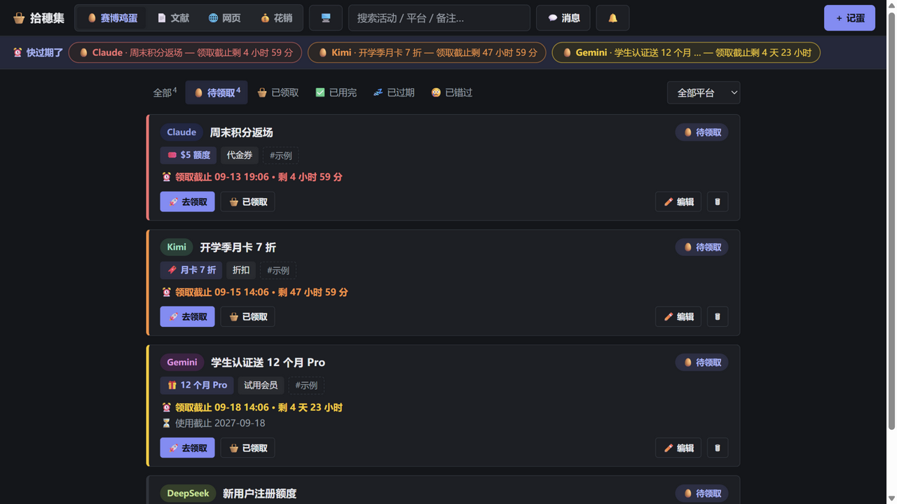
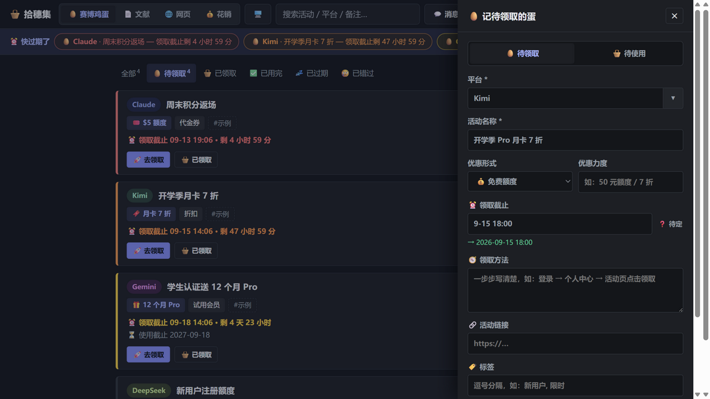
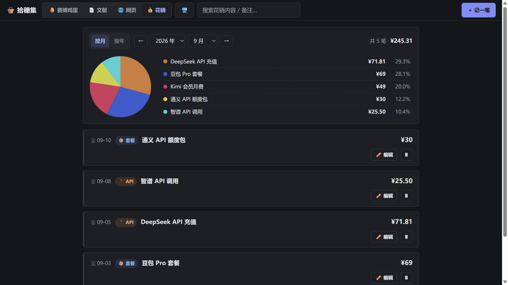

# 🧺 拾穗集 —— 赛博鸡蛋与文献拾穗

捡到什么就记什么。目前有四大板块，以后还能长出新的：

- **🥚 赛博鸡蛋**：记录各大模型平台的优惠活动（免费额度、代金券、折扣、试用会员……），按截止日期紧急程度排序展示，页面开着就自动提醒，**不漏领一颗赛博鸡蛋**。
- **📄 文献**：论文待读/已读管理。下载的论文丢进论文文件夹，在这里记一笔就能自动按类别归档，点「📖 阅读」直接用你指定的阅读软件打开，读完自动转入「已读」。
- **🌐 网页**：待读网页（技术文 / 杂项知识都收）的收藏与笔记。记链接就能存，点「🌐 打开」在浏览器打开并**把卡片顶到最前**，读完按类型引导你记下能复用的要点。
- **💰 花销**：学习、办公相关的开销记账（内容 + 金额 + 日期 + 备注）。按月看每一笔，按年按「📦 套餐 / 🔌 API」归纳，点类别可下钻看明细，列表跟着所选期间走；「🧭 体感评价」还能把记录里写的体感按厂商 / 模型凝练成评价，方便决定下次还买不买。

| 🥚 赛博鸡蛋 | ✍️ 记蛋 | 💰 花销 |
|---|---|---|
|  |  |  |

## 环境要求

- **Node.js ≥ 18**（只用标准库，无需 npm install）——没有的话去 [nodejs.org](https://nodejs.org/) 装一个 LTS 版即可
- Windows（启动脚本/桌面提醒按 Windows 设计；`node server.js` 本体其他平台也能跑）

## 快速开始

双击 **`start.bat`** 或桌面「拾穗集」快捷方式，会弹出一个**图形控制台窗口**：自动在后台启动服务并打开 `http://localhost:8642`。

- 窗口里有状态灯和三个按钮：**🚀 打开网页 / ▶ 启动服务 / ⏹ 停止服务**，全程没有黑窗口
- **关闭控制台窗口服务照常在后台运行**，网页不受影响；要真正停止请点「⏹ 停止服务」
- 无黑框启动链路：桌面快捷方式 → `launch.vbs` → `control-ui.ps1`（图形窗口）
- 也可以命令行操作：`powershell -File control.ps1 start|stop|status`；桌面快捷方式丢了就跑 `powershell -File make-shortcut.ps1` 重建
- 快捷方式换了图标？右键快捷方式 → 属性 → 更改图标，选 `assets\icon.ico`

手动启动（前台运行，关窗口即停止）：

```
node server.js
```

- 零依赖：只用到 Node.js 标准库，**无需 npm install**
- 内存占用约 30MB，可以一直挂着
- 换端口：改根目录 `config.json` 里的 `"port"`（服务端和图形控制台会一起生效）；临时覆盖可用环境变量 `PORT`（如 `set PORT=9000 && node server.js`）

首次打开页面是空的，点「填入示例数据看看效果」可以快速体验。

## 日常使用

| 想做什么 | 怎么做 |
|---|---|
| 记录一个活动 | 右上角「＋ 记蛋」，填平台、名称、截止时间、领取方法 |
| 看什么最紧急 | 顶部「⏰ 快过期了」横幅 + 卡片左侧颜色条（红 ≤24h / 橙 ≤3天 / 黄 ≤7天）；点横幅条目会跳到它所属的分类（待领取 / 已领取）并高亮闪一下 |
| 领到了 | 卡片上点「🧺 已领取」；用完了点「🏁 用完了」 |
| 去活动页 | 填了链接的卡片有主按钮：待领取「🚀 去领取」、已领取「🔍 查用量」，点一下直达 |
| 过了领取截止 | 填了明确截止时间的蛋，一过点会自动转入「已截止」并记一条消息；所有待领取的蛋卡片上都常驻「⏳ 已截止」，没到期也能随时手动结掉（误判可点卡片上的「✅ 其实领到了」改回） |
| 看过期消息 | 赛博鸡蛋顶栏「💬 消息」（在 🔔 通知开关左边）：未读时按钮上有红点数字，点开消息即已读变灰，可单条删 / 全部已读 / 清空已读；点「→ 查看原蛋」跳到对应分类并高亮 |
| 换浅色 / 深色 | 顶栏的 🖥️ / ☀️ / 🌙 按钮：点一下循环「跟随系统 → 浅色 → 深色」，选择记在浏览器里；默认跟随系统 |

### 桌面提醒

右上角 🔔 是一个**真开关**：首次点击授予通知权限并开启；之后再点一下就关闭（图标变 🔕 变暗），再点一下重新开启。开关状态存在浏览器里，刷新不丢。

开启状态下，只要页面开着，**领取截止前 24 小时内**（已领取的蛋：使用截止前 24 小时内）会弹系统通知；点击通知会自动跳到该蛋所在的分类标签页（待领取 / 已领取 / 已过期）并高亮。同一颗蛋只提醒一次（刷新页面也不会重复弹）。已领取的蛋一旦过了使用截止，会自动转入「已过期」；填了明确领取截止的待领取蛋一过点也会自动转入「已截止」。这两种自动流转除了弹系统通知，**还会各记一条到赛博鸡蛋顶栏「💬 消息」板块**，不怕通知一闪而过漏掉。想改提醒提前量，编辑 `public/config.js` 里的 `remind.hours`。

### 字段说明

- **领取截止**：什么时候之前要领（决定紧急程度排序和横幅提醒；填了明确时间、一过点就自动转入「已截止」并弹提示）
- **使用截止**：领到之后什么时候之前要用（「已领取」状态下会继续跟踪；过了就自动转入「已过期」并弹提示）
- **状态**：待领取 → 已领取 → 已用完；过了领取截止标「已截止」，过了使用截止标「已过期」
- **自由填写**：截止时间支持 `9-8`、`9/8 18:00`、`明天 14点` 等写法，不填年份默认今年；不知道就填「待定」，卡片会显示「待确认 ❓」并进横幅提醒（「待定」或没填的不会自动流转，但卡片上「⏳ 已截止」随时可手动结掉）
- **分模式记录**：记蛋面板分「🥚 待领取 / 🧺 待使用」，只显示相关字段，不臃肿

## 📄 文献板块

论文库根目录默认在项目目录下的 `papers\`（可用环境变量 `DANJI_PAPERS_DIR` 改成任意位置），首次使用自动创建：

```
papers\
├── （下载的论文先随手丢这里）
├── 待读\
│   └── 类别子文件夹\（如 待读\深度学习\xxx.pdf）
└── 已读\
    └── 类别子文件夹\
```

| 想做什么 | 怎么做 |
|---|---|
| 记一篇论文 | 「＋ 记论文」，标题**输入一部分就行**，会自动模糊匹配论文文件夹里的文件（高置信自动选中，多命中给候选列表） |
| 分类 | 「类别」可从已有类别选，也可直接输入新类别——保存时自动在待读/已读下建文件夹并归档 |
| 阅读 | 卡片上点「📖 阅读」，用该论文指定的阅读软件打开（没指定就用系统默认方式） |
| 排序 | 列表按**最近阅读时间**倒序：点「📖 阅读」的论文会**立刻升到列表顶部**（卡片短暂高亮 + 提示），卡片上显示「🕘 最近阅读」；没读过的按添加时间排；笔记里手填的「读完日期」也参与排序，所以补记一篇很久前读的论文不会莫名置顶 |
| 读完 | 点「✅ 读完了」，文件自动从 待读/类别 移到 已读/类别；点错了「↩️ 移回待读」搬回去 |
| 读完记一笔 | 点「✅ 读完了」会弹出「📝 阅读记录」抽屉：**写满三行速记（核心问题 / 核心做法 / 核心发现）并保存后，才会归档到「已读」**。没写满直接关掉，这篇还留在「待读」，已填内容会自动存成草稿，下次点「读完了」自动带回来。抽屉里其余字段（课题关系、能借鉴什么、可引用观点、下一步、最有用的部分、存疑局限、表达与摘抄）都不强制 |
| 重读再记 | 一篇论文可以记**多条**记录：卡片上点「📝 记录 N」→「＋ 再记一条」，形成阅读日志（按读完日期倒序）。已读后的补记只要写点东西就能存，不受三行门槛限制 |
| 把笔记用起来 | 搜索框能搜到笔记全文；筛选栏「笔记：已记 / 未记」一眼找出读过还没记的；已读卡片直接显示最新一条摘要 + 关联度徽章 |
| 换类别 | 编辑里改类别，文件自动搬到新类别文件夹 |
| 删除 | 只删记录，磁盘上的文件保持原位 |

阅读软件路径示例：`D:\Soft\SumatraPDF\SumatraPDF.exe`，留空 = 系统默认打开方式；会记住上次填写的路径。

## 🌐 网页（待读网页 + 笔记）

看到值得读的链接就丢进来，读完按类型引导记笔记，以后靠搜索和「用得上吗」翻回来复用。

| 想做什么 | 怎么做 |
|---|---|
| 记一个网页 | 顶栏切到「🌐 网页」→「＋ 记网页」：粘贴链接（写 `example.com` 也会自动补 `https://`），标题可以留空——离开链接框会自动抓网页 `<title>`，也可以点「🔄 自动取标题」 |
| 分类型 | 记的时候选「🔧 技术」或「🧩 杂项」，它决定读完后引导你填哪套字段（之后还能改） |
| 打开 | 卡片上点「🌐 打开」，在默认浏览器新标签页打开，并把这张卡**顶到列表最前**（卡片上会显示「🕘 最近阅读」） |
| 读完记笔记 | 点「✅ 读完了」→ 抽屉里**先选类型**再填：<br>🔧 **技术**：必须写满「🧠 一句话 + 🔧 关键做法 + 📈 结论」才归档到「已读」；另有 💻 工具/库、⚠️ 坑与局限<br>🧩 **杂项**：写一句「🧠 它讲了什么」就能归档；另有 ✅ 关键事实、🗓 什么时候会用到、🔍 来源可信度<br>两类共用：⚡ 用得上吗（立刻能用 / 以后可能用 / 长见识）、📖 值得原样记下的一句、🧭 还想顺着查什么 |
| 没写满就关掉 | 和文献一样：留在「待读」，已填内容存成草稿，下次点「读完了」自动带回来 |
| 重读再记 | 一个网页可以记**多条**笔记（按读完日期倒序），卡片上露最新一条的摘要 + 「用得上吗」徽章 |
| 找回来 | 搜索框能搜到标题、域名、链接、标签、备注和**所有笔记全文**；筛选支持 类型 / 用得上（⚡立刻能用就是行动清单）/ 未记笔记 |

排序规则与文献一致：按最近阅读时间倒序，没读过的按添加时间排。

## 💰 花销（按条目记账 + 两级饼图）

学习、办公相关的开销随手记一笔，按月 / 按年看清钱花在哪。每笔带一个**类别（📦 套餐 / 🔌 API）**，只用于归纳展示——年视图先按类别汇总，点一下再钻进这一类看每一笔。

| 想做什么 | 怎么做 |
|---|---|
| 记一笔 | 顶栏切到「💰 花销」→「＋ 记一笔」：填**花销内容**和**金额**就能存；日期默认今天，备注随便写一句 |
| 类别怎么定 | 抽屉里点「📦 套餐 / 🔌 API」；没点的话按标题自动猜：含 `api`/`接口` → API，含 `token`/`资源包`/`套餐`/`会员`/`pro`/`额度` 等 → 套餐（**套餐优先**，所以 token 包算套餐）。你点过之后就不再被自动改 |
| 金额怎么写 | `1280`、`1280.5`、`¥1,280`、`1,280.50` 都行（自动去符号和千分位）；**只支持正数**，写错会就地提示 |
| 按月看 | 统计卡切「按月」+ 选年月（或 ← → 翻月）：**饼图每个扇区 = 一笔花销**，右侧图例按金额从大到小列出「内容 · 金额 · 占比」；按月不按类别看，所以从「按年」下钻的状态切过来会自动清掉类别筛选 |
| 按年看 | 切「按年」+ 选年份：饼图先按类别归纳成 **📦 套餐 / 🔌 API 两个扇区**；**点扇区或图例那一行**就钻进去，饼图改成显示这一类里**同名合并后**的占比（这一年在这个名目上花了多少，图例带 `×N` 表示由几笔合成），下方列表同时只留这一类，右上角出现「正在看 📦 套餐 ✕」，再点一次或点 ✕ 回到总览 |
| 看明细 | 列表跟着所选期间（+ 类别）走，右上角显示「共 N 笔 · ¥X」；按日期倒序，同一天按录入时间倒序 |
| 找一笔 | 顶栏搜索框搜内容 / 备注，只在当前期间（和已选类别）内过滤 |
| 改 / 删 | 卡片上「✏️ 编辑」「🗑」（删除有确认）；卡片上有类别小徽章 |

饼图细节：类别层用 `config.js` 里定义的固定色相（套餐蓝、API 橙）；逐笔层按名字稳定取色（同名同色，月视图按记录 id），年视图下钻时同名记录合并成一个扇区、一行图例（行尾 `×N` 是合进来的笔数），明细列表里每笔照旧可见；一个期间超过 24 个扇区时，最小的若干笔会合并成一个「其余 N 笔」扇区（金额与占比仍准确），阈值是 `config.js` 里的 `expenses.maxSlices`。图例最多占 260px 高，条目多了在里面**上下滚动**，不会出现左右拖动条。

> 老数据不用管：启动时会给没有类别的旧记录按同一套关键词规则补一个类别，只写一次盘，不会覆盖你手动改过的值。

### 🧭 体感评价（从记录里凝练各家的使用体感）

花销板块顶部「📋 明细 / 🧭 体感评价」页签切换。评价视图看的是**全部历史**，把每笔花销的标题 + 备注认领到「主体」（DeepSeek、通义 Qwen、Kimi、Claude、LongCat、AutoDL 算力等，词表在 `config.js` 的 `expenses.subjects`，想收录新厂商就添一条关键词），按主体凝练出：

| 区块 | 内容 |
|---|---|
| 素材（自动） | 累计花费 · 笔数 · 类别拆分徽章 · 最近一笔日期，以及「📎 记录里的原话」：从备注里切出与这家相关的句子，按 💰价格 / 🧭决策 / 🧠体验 打标（词表 `expenses.insightTags`），每条注明来自哪笔花销 |
| 结论（你来写） | ⭐ 1-5 体感评分、「后续打算」快捷选项（➕ 继续 / ➖ 减少 / ⏸ 观望 / ⛔ 停掉）、一段总评文字——没有头绪时点「✨ 依记录生成草稿」，会把合计与要点摘录填进框里，改成自己的话再「💾 保存」即可；「🧹 清除」随时回到纯记录视角 |

评价按主体存进 `data/insights.json`，改评价不影响花销记录本身；备注太短没提到任何主体的花销不会出现在评价里，页面底部会提示哪几笔没被认领，照着去 `config.js` 加关键词就能收编。

## 数据与备份

所有数据存在 `data/eggs.json`（赛博鸡蛋）、`data/papers.json`（文献）、`data/sites.json`（网页）、`data/expenses.json`（花销）、`data/insights.json`（体感评价）与 `data/messages.json`（消息中心），纯文本 JSON，可直接查看编辑：

- **备份**：把 `data` 文件夹整个复制走就行（里面就五个 JSON 文件）
- **恢复**：把备份的 JSON 放回 `data/` 对应位置
- **迁移**：整个项目文件夹拷走就能用，数据跟着文件夹走
- 列表排序用的 `last_read_at`（论文 = 最近一次点「📖 阅读」、网页 = 最近一次点「🌐 打开」的时间）就存在对应 JSON 里，可手动清空，清空后该条回落到按添加时间排
- 写入采用「临时文件 + 重命名」，断电/崩溃不会写坏数据

## 想扩展功能？

架构就是为扩展准备的：

1. **改常量**（平台列表、优惠类型、提醒规则、网页笔记的字段词表、花销类别与饼图扇区上限）→ `public/config.js`（网页的两套引导字段在 `siteNote.fields`，归档门槛在 `siteNote.gate`；花销在 `expenses`，其中类别 id / 关键词要和 `server.js` 的 `EXPENSE_CATEGORIES` 同步）
2. **改界面/加视图** → `public/app.js`（Vue 3 组件，无需构建）+ `public/style.css`
3. **加接口** → `server.js` 里的 `route()` 表，加一行就是一个新端点
4. **数据字段变更** → `server.js` 里的 `normalizeActivity()` / `normalizePaper()` / `normalizeSite()` / `normalizeExpense()` 和 `migrate()`（配合 `schema_version` 做平滑迁移）

一些顺理成章的扩展方向：统计面板（这个月白嫖了多少钱）、同局域网手机访问（默认只监听本机 `127.0.0.1`，设环境变量 `DANJI_HOST=0.0.0.0` 后重启即可——注意 API 没有鉴权，仅在可信网络这么做）、接入通知机器人、定时抓取活动页。

## 常见问题

| 现象 | 处理 |
|---|---|
| 提示「端口被占用」/ 打不开 8642 | 拾穗集可能已经在运行了，直接访问 `http://localhost:8642`；确实要换端口就改 `config.json` 的 `"port"`（控制台会跟着变），或临时设环境变量 `PORT` |
| 双击脚本报「无法加载文件……执行策略」 | 管理员 PowerShell 跑一次 `Set-ExecutionPolicy -Scope CurrentUser RemoteSigned`；或者直接 `node server.js` |
| 页面显示「无法连接拾穗集服务」 | 后台服务没在运行：双击 `start.bat` 启动，然后点页面上的「重试」 |
| 记了内容保存没反应 | 看按钮：显示「⏳ 保存中…」是在等网络；弹出「无法连接服务」说明服务停了，重启服务后再保存，已填内容不会丢 |

## 开机自启（可选）

`Win + R` 输入 `shell:startup`，把**桌面「拾穗集」快捷方式**复制进去即可（或对 `launch.vbs` 右键 → 发送到 → 桌面快捷方式，把生成的快捷方式放进去）。开机后服务静默启动，**不会弹出任何窗口**。

## 技术栈

Node.js 标准库（http 服务 + JSON 存储）+ Vue 3（本地文件，无构建步骤）+ 手写 CSS。前端约 3300 行、后端约 1300 行，全部代码人类可读，适合随手改。

## License

[MIT](LICENSE)
